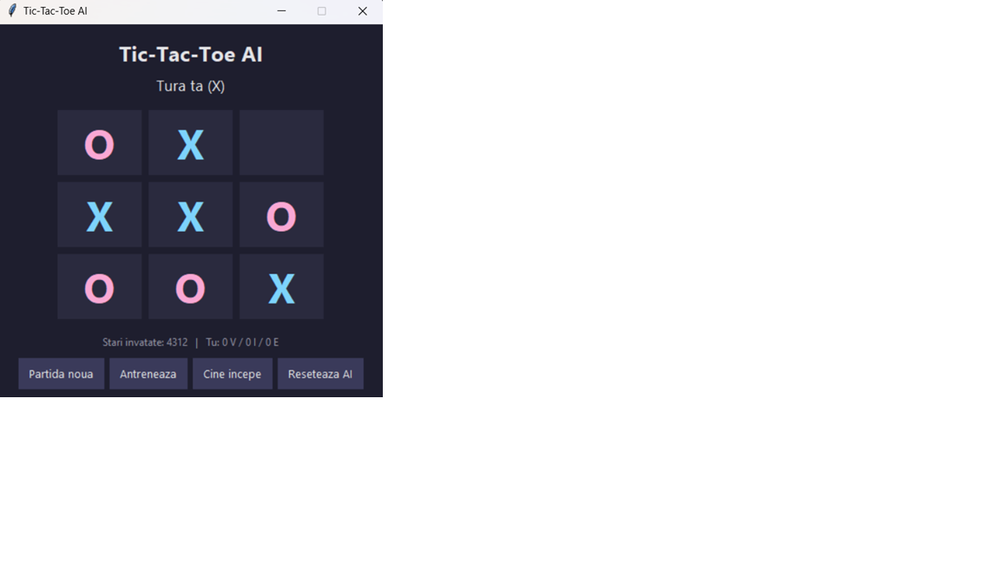

# Tic Tac Toe vs AI:

Hello!

In this project you play against an ai the classic game of tic tac toe.
At first the ai know only the rules but if you keep playing it will learn from mistakes.
If you do not have time to train it for thousands of games,you can use the setting that trains automatically very fast.
It is in the romanian language and it is a good game when bored:)).
Hope you like it:)).

## Technical information:

Project built in pyrhon 3.14.5
Also,the memory of the ai saves in a .json file.

## How to run:

Go to the releases section and there you will find a .exe file to run the game.

### How to play the game:

Since the game is in romanian I will make a guide on how to play it:
- "Da click pe o casuta" means to click at the wanted square to put your mark.(you are with X)
- "Partida noua" means new game.
- "Antreneaza" for training it automatically:after pressing the button put how many games of training(from 1 to 20 000 000).
- "Cine incepe" means who starts if you press that button the AI is going to start.
- "Reseteaza Ai" means to reset the AI an make it with 0 knowledge in strategies for Tic Tac Toe.

## AI use:

Ai used for debugging.

#horizons
